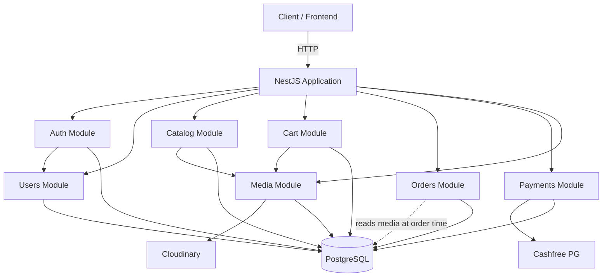

# Kazraa Backend — Technical Documentation

## Project Purpose

Kazraa Backend is the server-side application for the **Kazraa Fashion** e-commerce platform. It provides REST APIs for customer-facing shopping workflows (browse, cart, order, pay) and admin-facing catalog/order management. The application is built for the Indian fashion market with INR as the default currency, Indian addresses, and Cashfree as the payment gateway.

## Main Features

| Domain | Capabilities |
| --- | --- |
| **Auth** | Email/phone registration, login, JWT access + refresh tokens, logout |
| **Users** | Profile management, password change, soft-delete |
| **Addresses** | CRUD with default-address logic, soft-delete |
| **Catalog** | Categories (hierarchical), Products (with sizes, attributes, media), Size Types, Sizes, Attributes + Options |
| **Media** | Upload to Cloudinary, polymorphic attachment to entities (Product, Category, etc.), soft-delete |
| **Cart** | Get-or-create active cart, add/update/remove items, stock validation |
| **Orders** | Cart-to-order conversion, order number generation, stock decrement, status transitions, cancellation with stock restore, customer returns, admin RTO |
| **Payments** | Provider-agnostic architecture, Cashfree implementation, payment creation/verification, webhooks, refunds |

## Technology Stack

| Layer | Technology |
| --- | --- |
| Runtime | Node.js |
| Framework | NestJS 11 |
| Language | TypeScript 5 |
| ORM | Prisma 7 (with `@prisma/adapter-pg` driver adapter) |
| Database | PostgreSQL |
| Auth | JWT (`@nestjs/jwt`), bcrypt |
| Payment Gateway | Cashfree PG (`cashfree-pg` SDK) |
| File Storage | Cloudinary (`cloudinary` SDK) |
| Validation | class-validator, class-transformer |
| Package Manager | pnpm 12 |

## Architecture Style

Modular monolith following the NestJS module pattern:

```
Controller → Service → Prisma (PostgresService) → PostgreSQL
```

All modules are registered in a single `AppModule`. Cross-cutting concerns (JWT, database) are provided via global modules. External services (Cloudinary, Cashfree) are abstracted behind provider interfaces for swappability.

## High-Level Architecture



## Module Overview

| Module | Path | Responsibility |
| --- | --- | --- |
| `AppModule` | `src/app.module.ts` | Root module, loads config and all feature modules |
| `JwtAuthModule` | `src/common/jwt/` | Global JWT configuration, auth guard, roles guard |
| `PostgresModule` | `src/database/postgres/` | Global Prisma client wrapper |
| `AuthModule` | `src/auth/` | Registration, login, token management, logout |
| `UsersModule` | `src/users/` | User profile, addresses |
| `CatalogModule` | `src/catalog/` | Categories, products, sizes, size-types, attributes |
| `CartModule` | `src/cart/` | Shopping cart operations |
| `OrdersModule` | `src/orders/` | Order lifecycle, returns, RTO |
| `PaymentsModule` | `src/payments/` | Payment creation, verification, webhooks, refunds |
| `MediaModule` | `src/media/` | File upload, polymorphic media attachment, Cloudinary storage |

## External Services

| Service | Purpose | SDK |
| --- | --- | --- |
| **Cashfree PG** | Online payment processing | `cashfree-pg` v6 |
| **Cloudinary** | Image/video storage and CDN | `cloudinary` v2 |

## Database

PostgreSQL accessed through Prisma ORM 7 with the `@prisma/adapter-pg` driver adapter. Schema defined in `prisma/schema.prisma` with 24 models.

## Authentication

JWT-based with separate access and refresh tokens. Access tokens are sent via `Authorization: Bearer` header. Refresh tokens are stored as HTTP-only cookies and hashed (SHA-256) before database storage.

## Payment System

Provider-agnostic design with a factory pattern. Currently only Cashfree is implemented. Razorpay is defined in the enum but throws "not implemented" at runtime.

## Frontend Communication

The backend exposes a RESTful JSON API. No global API prefix is applied in `main.ts` (the `API_PREFIX` config is registered but not used). CORS is not explicitly configured. Cookies are used for refresh tokens (`path: /auth`).

## How to Run

```bash
# 1. Install dependencies
pnpm install

# 2. Configure environment
cp .env.example .env
# Edit .env with your credentials

# 3. Generate Prisma client
pnpm prisma generate

# 4. Run database migrations
pnpm prisma migrate deploy

# 5. Start development server
pnpm start:dev

# 6. Production build
pnpm build
pnpm start:prod
```

## Required Environment Variables

See [configuration.md](./configuration.md) for the full table.

```env
NODE_ENV=development
PORT=3000
API_PREFIX=api
DATABASE_URL=<your-database-url>
JWT_ACCESS_SECRET=<your-secret>
JWT_ACCESS_EXPIRES_IN=15m
JWT_REFRESH_SECRET=<your-secret>
JWT_REFRESH_EXPIRES_IN=7d
BCRYPT_SALT_ROUNDS=12
CASHFREE_ENVIRONMENT=SANDBOX
CASHFREE_APP_ID=<your-cashfree-app-id>
CASHFREE_SECRET_KEY=<your-cashfree-secret-key>
PAYMENT_RETURN_URL=<your-url>
PAYMENT_WEBHOOK_URL=<your-url>
CLOUDINARY_CLOUD_NAME=<your-cloud-name>
CLOUDINARY_API_KEY=<your-api-key>
CLOUDINARY_API_SECRET=<your-api-secret>
MEDIA_MAX_IMAGE_SIZE_MB=10
MEDIA_MAX_VIDEO_SIZE_MB=50
```

## Important Commands

| Command | Description |
| --- | --- |
| `pnpm start:dev` | Start dev server with watch mode |
| `pnpm start:debug` | Start with debug + watch |
| `pnpm build` | Compile TypeScript |
| `pnpm start:prod` | Run compiled JS (`dist/src/main.js`) |
| `pnpm lint` | Lint and auto-fix |
| `pnpm format` | Prettier format |
| `pnpm test` | Run unit tests |
| `pnpm prisma generate` | Regenerate Prisma Client |
| `pnpm prisma migrate dev` | Create/apply dev migrations |

---

## Documentation Index

| Document | Description |
| --- | --- |
| [Architecture](./architecture.md) | System architecture, layers, patterns |
| [Project Structure](./project-structure.md) | File/folder organization |
| [Application Flow](./application-flow.md) | Request lifecycle, startup |
| [Authentication](./authentication.md) | Auth lifecycle, JWT, guards |
| [Database](./database.md) | Prisma schema, models, ER diagram |
| [API Reference](./api.md) | All endpoints grouped by module |
| [Configuration](./configuration.md) | Environment variables |
| [Error Handling](./error-handling.md) | Exception strategy |
| [Integrations](./integrations.md) | Cashfree, Cloudinary |
| [Deployment](./deployment.md) | Build, deploy, hosting |
| [Known Issues](./known-issues.md) | Bugs, concerns, suggestions |
| **Module Docs** | |
| [Auth Module](./modules/auth.md) | Registration, login, tokens |
| [Users Module](./modules/users.md) | Profile, addresses |
| [Catalog Module](./modules/catalog.md) | Products, categories, sizes, attributes |
| [Cart Module](./modules/cart.md) | Shopping cart |
| [Orders Module](./modules/orders.md) | Order lifecycle |
| [Payments Module](./modules/payments.md) | Payment architecture |
| [Media Module](./modules/media.md) | File upload, attachment |
| **Workflow Docs** | |
| [User Registration](./workflows/user-registration.md) | Full registration flow |
| [Login](./workflows/login.md) | Login + token issuance |
| [Order Creation](./workflows/order-creation.md) | Cart → Order conversion |
| [Payment](./workflows/payment.md) | Payment creation → verification |
| [Order Cancellation](./workflows/order-cancellation.md) | Cancel + stock restore |

---

## Documentation Coverage

| Area | Covered |
| --- | --- |
| All modules | ✅ |
| All API endpoints | ✅ |
| Database schema (all 24 models) | ✅ |
| Authentication lifecycle | ✅ |
| Payment architecture | ✅ |
| Media system | ✅ |
| Order workflow | ✅ |
| Configuration | ✅ |
| Error handling | ✅ |
| Known issues | ✅ |
| Collections module (stub only) | ✅ Documented as unimplemented |
