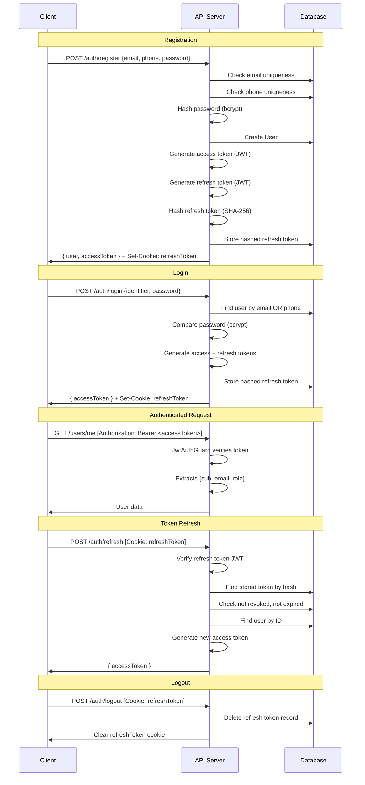

# Authentication & Authorization

## Overview

Kazraa uses a JWT-based authentication system with **separate access and refresh tokens**:

- **Access Token**: Short-lived (default 15m), sent via `Authorization: Bearer` header
- **Refresh Token**: Long-lived (default 7d), stored as an HTTP-only cookie, hashed (SHA-256) before database persistence

## Authentication Lifecycle



## Password Handling

| Step | Implementation |
| --- | --- |
| **Hashing** | `bcrypt.hash(password, saltRounds)` |
| **Salt Rounds** | `BCRYPT_SALT_ROUNDS` env var (default: 12) |
| **Comparison** | `bcrypt.compare(plaintext, hash)` |
| **Change Password** | Validates current password, rejects if new === old, hashes new, updates DB |

> ⚠️ **Note**: The `register()` and `changePassword()` methods read `BCRYPT_SALT_ROUNDS` directly from `process.env` instead of using the `auth.bcryptSaltRounds` config value. See [known-issues.md](./known-issues.md).

## JWT Token Structure

### Access Token Payload

```json
{
  "sub": "<user-id>",
  "email": "<user-email>",
  "role": "CUSTOMER" | "ADMIN",
  "iat": 1234567890,
  "exp": 1234568790
}
```

### Configuration

| Setting | Config Key | Default |
| --- | --- | --- |
| Access token secret | `auth.accessTokenSecret` | Required |
| Access token expiry | `auth.accessTokenExpiresIn` | `15m` |
| Refresh token secret | `auth.refreshTokenSecret` | Required |
| Refresh token expiry | `auth.refreshTokenExpiresIn` | `7d` |

## Refresh Token Security

1. **Hashed storage**: Refresh tokens are hashed with SHA-256 before being stored in the `RefreshToken` table. The raw token is never persisted.
2. **HTTP-only cookie**: The raw token is sent to the client via an HTTP-only cookie (`path: /auth`), preventing JavaScript access.
3. **Secure flag**: In production (`NODE_ENV === 'production'`), the cookie is set with `secure: true`.
4. **SameSite**: Set to `lax` to prevent CSRF in most cases.
5. **Revocation**: On logout, the token record is deleted from the database.

## Guards

### JwtAuthGuard (`src/common/jwt/jwt-auth.guard.ts`)

- Implements `CanActivate`
- Extracts `Bearer` token from `Authorization` header
- Verifies token using `JwtService.verifyAsync()` (configured with access token secret)
- Attaches decoded payload to `request.user`
- Throws `UnauthorizedException` if token is missing/invalid/expired

### RolesGuard (`src/common/jwt/roles.guard.ts`)

- Implements `CanActivate`
- Reads required roles from `@Roles()` decorator metadata using `Reflector`
- If no `@Roles()` decorator is present, allows access (returns `true`)
- Compares `request.user.role` against required roles
- Throws `ForbiddenException` if role doesn't match
- **Must** be used after `JwtAuthGuard` (depends on `request.user` being set)

### @Roles Decorator (`src/common/jwt/roles.decorator.ts`)

```typescript
@Roles(UserRole.ADMIN)  // Only ADMIN can access
```

Uses `SetMetadata('roles', roles)` to attach role requirements to route handlers.

## Roles

The system supports two roles defined in the `UserRole` enum:

| Role | Description |
| --- | --- |
| `CUSTOMER` | Default role for registered users. Can manage profile, cart, orders, returns. |
| `ADMIN` | Can manage catalog (products, categories, sizes, attributes), view all orders, update order status, upload media, initiate RTO. |

## Protected Routes Summary

| Route | Auth | Role |
| --- | --- | --- |
| `POST /auth/register` | ❌ | — |
| `POST /auth/login` | ❌ | — |
| `POST /auth/refresh` | ❌ (cookie) | — |
| `POST /auth/logout` | ❌ (cookie) | — |
| `GET/PATCH/DELETE /users/me` | ✅ JWT | Any |
| `PATCH /users/me/password` | ✅ JWT | Any |
| `GET/POST/PATCH/DELETE /users/me/addresses` | ✅ JWT | Any |
| `GET /catalog/*` | ❌ | — |
| `POST/PATCH/DELETE /catalog/*` | ✅ JWT | ADMIN |
| `GET/POST/PATCH/DELETE /cart` | ✅ JWT | Any |
| `POST /orders` | ✅ JWT | Any |
| `GET /orders/me` | ✅ JWT | Any |
| `PATCH /orders/:id/cancel` | ✅ JWT | Any (customer limited to own orders) |
| `POST /orders/:id/return` | ✅ JWT | Any |
| `GET /orders` (all) | ✅ JWT | ADMIN |
| `PATCH /orders/:id/status` | ✅ JWT | ADMIN |
| `POST /orders/:id/rto` | ✅ JWT | ADMIN |
| `POST /payments` | ✅ JWT | Any |
| `POST /payments/verify` | ✅ JWT | Any |
| `POST /payments/:orderId/refund` | ✅ JWT | Any (⚠️ see known-issues) |
| `POST /payments/webhook/cashfree` | ❌ | — |
| `POST /media/upload` | ✅ JWT | ADMIN |
| `GET /media` | ✅ JWT | ADMIN |
| `GET /media/:id` | ✅ JWT | ADMIN |
| `DELETE /media/:id` | ✅ JWT | ADMIN |

## Token Refresh Flow

```
verifyRefreshToken(token)
  ↓  JwtService.verifyAsync() with refresh secret
validateStoredRefreshToken(token)
  ↓  SHA-256 hash → find in DB → check not revoked → check not expired
findUser(payload.sub)
  ↓  Verify user still exists
generateAccessToken(payload)
  ↓
Return { accessToken }
```

> **Note**: The refresh flow issues a new access token but does **NOT** rotate the refresh token. The same refresh token remains valid until it expires or is explicitly revoked.
