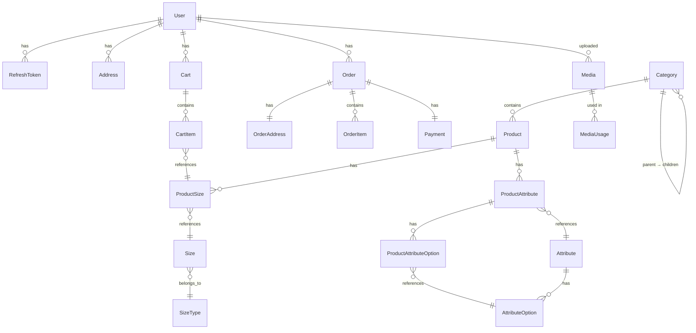

# Database Schema

## Overview

The database is **PostgreSQL**, accessed through **Prisma ORM 7** with the `@prisma/adapter-pg` driver adapter. The schema is defined in `prisma/schema.prisma`.

## Connection

```typescript
// src/database/postgres/postgres.service.ts
@Injectable()
export class PostgresService extends PrismaClient {
  constructor() {
    const adapter = new PrismaPg({
      connectionString: process.env.DATABASE_URL
    });
    super({ adapter });
  }
}
```

`PostgresModule` is `@Global()`, so `PostgresService` is available everywhere without explicit imports.

## Entity Relationship Diagram



## Models

### User

| Field | Type | Notes |
| --- | --- | --- |
| id | String (UUID) | Primary key |
| email | String | Unique |
| phone | String | Unique |
| password | String | Bcrypt hash |
| firstName | String? | |
| lastName | String? | |
| role | UserRole | Default: CUSTOMER |
| isDeleted | Boolean | Default: false |
| createdAt | DateTime | Auto-set |
| updatedAt | DateTime | Auto-updated |

### RefreshToken

| Field | Type | Notes |
| --- | --- | --- |
| id | String (UUID) | |
| userId | String | FK → User |
| tokenHash | String | SHA-256 of the raw JWT |
| expiresAt | DateTime | |
| isRevoked | Boolean | Default: false |
| createdAt | DateTime | |

### Address

| Field | Type | Notes |
| --- | --- | --- |
| id | String (UUID) | |
| userId | String | FK → User |
| firstName | String | |
| lastName | String | |
| phone | String | |
| addressLine1 | String | |
| addressLine2 | String? | |
| city | String | |
| state | String | |
| postalCode | String | |
| country | String | Default: "India" |
| isDefault | Boolean | Default: false |
| deletedAt | DateTime? | Soft delete |

### Category

| Field | Type | Notes |
| --- | --- | --- |
| id | String (UUID) | |
| name | String | Unique |
| slug | String | Unique, generated from name |
| description | String? | |
| parentId | String? | FK → Category (self-referential) |
| isActive | Boolean | Default: true |
| deletedAt | DateTime? | Soft delete |

### Product

| Field | Type | Notes |
| --- | --- | --- |
| id | String (UUID) | |
| categoryId | String | FK → Category |
| name | String | |
| slug | String | Unique, generated from name |
| shortDescription | String? | |
| description | String? | |
| seoTitle | String? | |
| seoDescription | String? | |
| seoKeywords | String[] | |
| status | ProductStatus | Default: DRAFT |
| deletedAt | DateTime? | Soft delete |

**Enum `ProductStatus`**: `DRAFT`, `ACTIVE`, `ARCHIVED`

### ProductSize

| Field | Type | Notes |
| --- | --- | --- |
| id | String (UUID) | |
| productId | String | FK → Product |
| sizeId | String | FK → Size |
| sku | String | Unique — stock keeping unit |
| barcode | String? | Unique |
| mrp | Decimal | Maximum retail price |
| sellingPrice | Decimal | ≤ MRP |
| availableStock | Int | Default: 0 |
| weight | Decimal? | |
| isActive | Boolean | Default: true |
| deletedAt | DateTime? | Soft delete |

**Compound unique**: `(productId, sizeId)` — a product cannot have the same size twice.

### SizeType

| Field | Type | Notes |
| --- | --- | --- |
| id | String (UUID) | |
| name | String | Unique (e.g., "Clothing", "Footwear") |
| slug | String | Unique |
| description | String? | |
| isActive | Boolean | Default: true |
| deletedAt | DateTime? | Soft delete |

### Size

| Field | Type | Notes |
| --- | --- | --- |
| id | String (UUID) | |
| sizeTypeId | String | FK → SizeType |
| label | String | Display label (e.g., "S", "M", "L") |
| value | String | Slug-based (e.g., "s", "m", "l") |
| sortOrder | Int | Default: 0 |
| isActive | Boolean | Default: true |

**Compound unique**: `(sizeTypeId, value)` — a size value is unique within its type.

### Attribute

| Field | Type | Notes |
| --- | --- | --- |
| id | String (UUID) | |
| name | String | Unique |
| slug | String | Unique |
| type | AttributeType | |
| description | String? | |
| isRequired | Boolean | Default: false |
| isFilterable | Boolean | Default: false |
| isActive | Boolean | Default: true |
| sortOrder | Int | Default: 0 |
| deletedAt | DateTime? | Soft delete |

**Enum `AttributeType`**: `TEXT`, `TEXTAREA`, `NUMBER`, `BOOLEAN`, `DATE`, `URL`, `SELECT`, `MULTI_SELECT`, `COLOR`

### AttributeOption

| Field | Type | Notes |
| --- | --- | --- |
| id | String (UUID) | |
| attributeId | String | FK → Attribute |
| label | String | Display text |
| value | String | Slug-based |
| sortOrder | Int | Default: 0 |
| isActive | Boolean | Default: true |

**Compound unique**: `(attributeId, value)`

### ProductAttribute

| Field | Type | Notes |
| --- | --- | --- |
| id | String (UUID) | |
| productId | String | FK → Product |
| attributeId | String | FK → Attribute |
| value | String? | Free-form value (TEXT, NUMBER, etc.) |

**Compound unique**: `(productId, attributeId)`

### ProductAttributeOption

| Field | Type | Notes |
| --- | --- | --- |
| id | String (UUID) | |
| productAttributeId | String | FK → ProductAttribute |
| optionId | String | FK → AttributeOption |

**Compound unique**: `(productAttributeId, optionId)`

### Cart

| Field | Type | Notes |
| --- | --- | --- |
| id | String (UUID) | |
| userId | String | FK → User |
| status | CartStatus | Default: ACTIVE |
| createdAt | DateTime | |
| updatedAt | DateTime | |

**Enum `CartStatus`**: `ACTIVE`, `CONVERTED`

### CartItem

| Field | Type | Notes |
| --- | --- | --- |
| id | String (UUID) | |
| cartId | String | FK → Cart |
| productSizeId | String | FK → ProductSize |
| quantity | Int | Minimum: 1 |
| addedAt | DateTime | |
| updatedAt | DateTime | |

**Compound unique**: `(cartId, productSizeId)`

### Order

| Field | Type | Notes |
| --- | --- | --- |
| id | String (UUID) | |
| orderNumber | String | Unique, auto-generated (KZ-YYMMDD-NNNN) |
| userId | String | FK → User |
| status | OrderStatus | Default: PENDING |
| subtotal | Decimal | Sum of line items |
| shipping | Decimal | ₹0 or ₹99 |
| total | Decimal | subtotal + shipping |
| notes | String? | Customer notes |
| cancellationReason | String? | |
| returnReason | String? | |
| rtoReason | String? | |

**Enum `OrderStatus`**: `PENDING`, `CONFIRMED`, `PROCESSING`, `SHIPPED`, `DELIVERED`, `CANCELLED`, `RETURN_REQUESTED`, `RETURNED`, `RTO`

### OrderAddress

| Field | Type | Notes |
| --- | --- | --- |
| id | String (UUID) | |
| orderId | String | FK → Order (1:1), unique |
| firstName | String | Snapshot of address at order time |
| lastName | String | |
| phone | String | |
| addressLine1 | String | |
| addressLine2 | String? | |
| city | String | |
| state | String | |
| postalCode | String | |
| country | String | |

### OrderItem

| Field | Type | Notes |
| --- | --- | --- |
| id | String (UUID) | |
| orderId | String | FK → Order |
| productSizeId | String | FK → ProductSize |
| productName | String | Snapshot |
| productSlug | String | Snapshot |
| sku | String | Snapshot |
| sizeName | String | Snapshot |
| primaryMediaId | String? | Snapshot of media ID |
| quantity | Int | |
| price | Decimal | Per-unit selling price at order time |
| total | Decimal | price × quantity |

### Payment

| Field | Type | Notes |
| --- | --- | --- |
| id | String (UUID) | |
| orderId | String | FK → Order (1:1), unique |
| amount | Decimal | = order.total |
| method | PaymentMethod | |
| status | PaymentStatus | Default: PENDING |
| provider | PaymentProvider? | |
| providerOrderId | String? | ID in the payment gateway |
| providerPaymentId | String? | Payment ID from the gateway |
| providerResponse | Json? | Raw API response stored for audit |
| paidAt | DateTime? | |
| createdAt | DateTime | |
| updatedAt | DateTime | |

**Enum `PaymentMethod`**: `COD`, `ONLINE`, `UPI`, `CARD`, `NET_BANKING`, `WALLET`

**Enum `PaymentStatus`**: `PENDING`, `PAID`, `FAILED`, `REFUNDED`

**Enum `PaymentProvider`**: `CASHFREE`, `RAZORPAY`

### Media

| Field | Type | Notes |
| --- | --- | --- |
| id | String (UUID) | |
| type | MediaType | IMAGE or VIDEO |
| status | MediaStatus | TEMPORARY → ACTIVE → DELETED |
| purpose | MediaPurpose | |
| url | String | CDN URL |
| storageProvider | StorageProvider | Currently CLOUDINARY |
| publicId | String? | Cloudinary public ID |
| originalName | String? | Original filename |
| mimeType | String? | e.g., image/jpeg |
| size | BigInt? | File size in bytes |
| width | Int? | |
| height | Int? | |
| duration | Float? | Video duration in seconds |
| uploadedById | String? | FK → User |
| deletedAt | DateTime? | Soft delete |

**Enum `MediaType`**: `IMAGE`, `VIDEO`

**Enum `MediaStatus`**: `TEMPORARY`, `ACTIVE`, `DELETED`

**Enum `MediaPurpose`**: `PRODUCT`, `CATEGORY`, `BANNER`, `PROFILE`, `OTHER`

### MediaUsage

| Field | Type | Notes |
| --- | --- | --- |
| id | String (UUID) | |
| mediaId | String | FK → Media |
| entityType | MediaEntityType | Polymorphic key |
| entityId | String | UUID of the entity |
| role | MediaRole | PRIMARY or GALLERY |
| sortOrder | Int | Default: 0 |

**Enum `MediaEntityType`**: `PRODUCT`, `CATEGORY`, `BANNER`, `COLLECTION`

**Enum `MediaRole`**: `PRIMARY`, `GALLERY`

This is a **polymorphic relationship**: `entityType` + `entityId` can point to any entity (Product, Category, etc.) without foreign keys.

### OrderCounter

| Field | Type | Notes |
| --- | --- | --- |
| dateKey | String | PK — format "YYMMDD" |
| lastSequence | Int | Last used sequence number for that day |

Used internally by `OrdersService.generateOrderNumber()` for atomic order number generation.

## Key Design Patterns

### Soft Deletes
Most entities use `deletedAt: DateTime?` instead of hard deletes. Queries filter with `deletedAt: null`.

### Snapshots in Orders
`OrderItem` and `OrderAddress` store product and address data at the time of order creation, so changes to the original entities don't affect historical orders.

### Polymorphic Media
`MediaUsage` uses `entityType` + `entityId` instead of separate foreign keys per entity type. This allows the media system to be reused across Products, Categories, Banners, and Collections without schema changes.

### Interactive Transactions
Complex multi-step mutations use `prisma.$transaction(async (tx) => { ... })` to ensure atomicity. The transaction client (`tx`) is passed down to service methods to stay within the transaction boundary.
