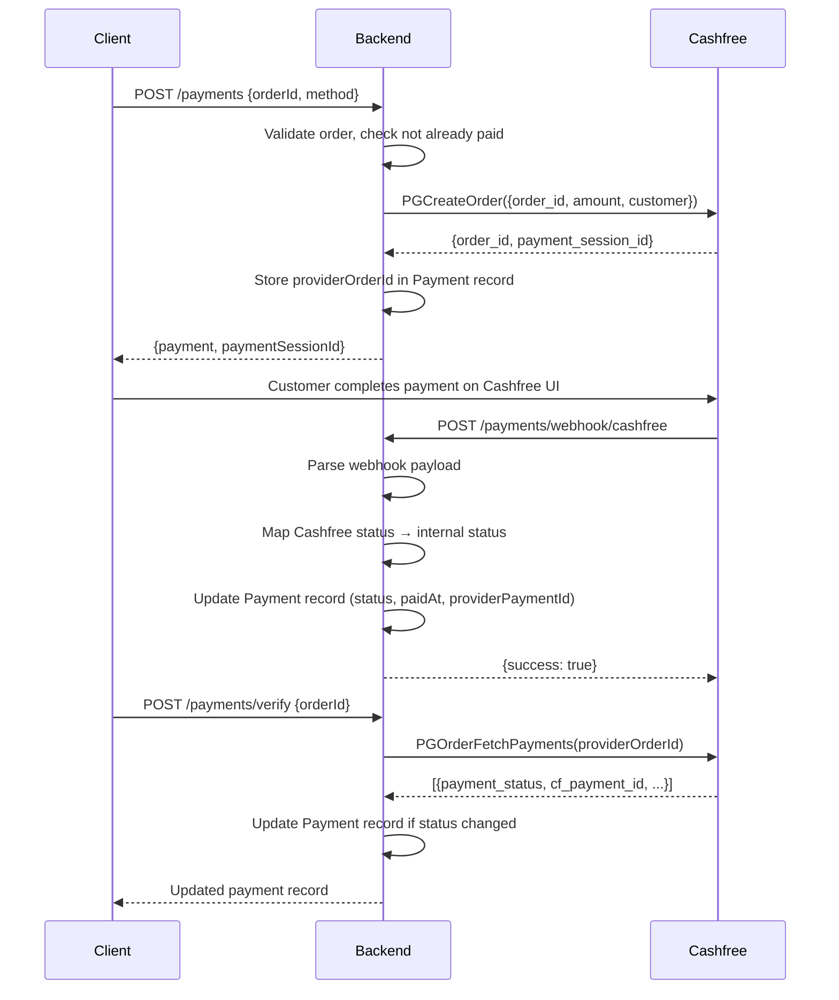

# External Integrations

## Cashfree Payment Gateway

### Architecture

```
PaymentsService
  └── PaymentProviderFactory.getProvider(CASHFREE)
        └── CashfreeProvider (implements PaymentProvider interface)
              └── CashfreeClient (wraps Cashfree SDK)
                    └── Cashfree SDK (`cashfree-pg`)
```

### Provider Pattern

The payment system uses a **factory + strategy pattern**:

1. **`PaymentProvider` interface** — defines `createPayment()`, `verifyPayment()`, `refundPayment()`, `handleWebhook()`
2. **`PaymentProviderFactory`** — receives the provider enum, returns the correct implementation
3. **`CashfreeProvider`** — implements the interface for Cashfree
4. **`CashfreeClient`** — low-level wrapper around `Cashfree` SDK methods
5. **`CashfreeMapper`** — maps Cashfree-specific responses to internal types

### Configuration

| Env Variable | Config Key | Description |
| --- | --- | --- |
| `CASHFREE_ENVIRONMENT` | `cashfree.environment` | `SANDBOX` or `PRODUCTION` |
| `CASHFREE_APP_ID` | `cashfree.appId` | Application ID from Cashfree dashboard |
| `CASHFREE_SECRET_KEY` | `cashfree.secretKey` | Secret key |
| `PAYMENT_RETURN_URL` | `payment.returnURL` | Customer redirect URL after payment |
| `PAYMENT_WEBHOOK_URL` | `payment.webhookURL` | Webhook endpoint for payment notifications |

### SDK Initialization

```typescript
// CashfreeClient constructor
this.cashfree = new Cashfree(
  environment === 'PRODUCTION'
    ? CFEnvironment.PRODUCTION
    : CFEnvironment.SANDBOX,
  appId,
  secretKey,
);
```

### Cashfree SDK Methods Used

| Method | Purpose |
| --- | --- |
| `PGCreateOrder(request)` | Create a payment order |
| `PGFetchOrder(orderId)` | Fetch order details |
| `PGOrderFetchPayments(orderId)` | Get all payments for an order |
| `PGOrderFetchPayment(orderId, paymentId)` | Get specific payment |
| `PGOrderCreateRefund(orderId, request)` | Initiate refund |

### Payment Flow



### Status Mapping (Cashfree → Internal)

| Cashfree Status | Internal PaymentStatus |
| --- | --- |
| `SUCCESS`, `PAID` | `PAID` |
| `FAILED`, `CANCELLED` | `FAILED` |
| `PENDING`, `USER_DROPPED`, `NOT_ATTEMPTED` | `PENDING` |
| Any other | `PENDING` |

### Provider Order ID Format

```
kazraa_<orderId>
```

Example: `kazraa_abc123-def456-...`

### Refund

```typescript
refundId: `refund_${orderId}_${Date.now()}`
refund_speed: 'STANDARD'
```

### Webhook Handling

The webhook endpoint (`POST /payments/webhook/cashfree`) is **unauthenticated**. The raw body is passed but **signature verification is not implemented** in the current code (there's a comment noting this). The webhook:

1. Parses the nested payload to extract `order_id`, `payment_status`, `cf_payment_id`
2. Looks up the payment by `providerOrderId`
3. **Never downgrades** a `PAID` payment to any other status
4. Updates the payment record

### Razorpay

`RAZORPAY` exists in the `PaymentProvider` enum and in the factory switch-case, but throws:
```
Error('Razorpay provider is not implemented yet')
```

---

## Cloudinary (Media Storage)

### Architecture

```
MediaService
  └── @Inject(MEDIA_STORAGE) → MediaStorageProvider interface
        └── CloudinaryStorage (implements MediaStorageProvider)
              └── Cloudinary SDK v2
```

### Provider Pattern

The media system uses **NestJS custom provider injection**:

1. **`MediaStorageProvider` interface** — defines `upload()`, `delete()`, `getUrl()`
2. **`MEDIA_STORAGE` token** — a `Symbol` used for DI
3. **`CloudinaryStorage`** — implements the interface for Cloudinary
4. **Module registration**:
   ```typescript
   { provide: MEDIA_STORAGE, useClass: CloudinaryStorage }
   ```

### Configuration

| Env Variable | Config Key | Description |
| --- | --- | --- |
| `CLOUDINARY_CLOUD_NAME` | `cloudinary.cloudName` | Cloudinary cloud name |
| `CLOUDINARY_API_KEY` | `cloudinary.apiKey` | API key |
| `CLOUDINARY_API_SECRET` | `cloudinary.apiSecret` | API secret |
| `MEDIA_MAX_IMAGE_SIZE_MB` | `media.maxImageSizeMb` | Max image size (default: 10 MB) |
| `MEDIA_MAX_VIDEO_SIZE_MB` | `media.maxVideoSizeMb` | Max video size (default: 50 MB) |

### SDK Initialization

```typescript
// CloudinaryStorage constructor
cloudinary.config({
  cloud_name: configService.getOrThrow('cloudinary.cloudName'),
  api_key: configService.getOrThrow('cloudinary.apiKey'),
  api_secret: configService.getOrThrow('cloudinary.apiSecret'),
  secure: true,
});
```

### Upload Flow

```
1. MediaController receives multipart/form-data (via @UseInterceptors(FileInterceptor('file')))
2. MediaService.upload() validates file (type, size)
3. CloudinaryStorage.upload() streams buffer to Cloudinary
4. Cloudinary returns: url, public_id, width, height, duration
5. MediaService creates Media record (status: TEMPORARY)
6. Returns serialized media (BigInt.size → Number)
```

### Folder Structure in Cloudinary

Files are stored in folders based on their purpose:

```
kazraa/product/       ← MediaPurpose.PRODUCT
kazraa/category/      ← MediaPurpose.CATEGORY
kazraa/banner/        ← MediaPurpose.BANNER
kazraa/profile/       ← MediaPurpose.PROFILE
kazraa/other/         ← MediaPurpose.OTHER
```

### File Naming

Each file gets a UUID-based name to avoid collisions:

```typescript
generateFileName('photo.jpg') → 'a1b2c3d4-e5f6-7890-abcd-ef1234567890.jpg'
```

### Allowed MIME Types

| Type | MIME Types |
| --- | --- |
| Image | `image/jpeg`, `image/png`, `image/webp` |
| Video | `video/mp4`, `video/webm`, `video/quicktime` |

### Error Recovery

If the database insert fails after a successful Cloudinary upload, the service attempts to clean up the uploaded file:

```typescript
try {
  uploaded = await this.storage.upload(...);
  media = await this.prisma.media.create(...);
} catch {
  if (uploaded?.publicId) {
    await this.storage.delete(uploaded.publicId, resourceType);
  }
  throw error;
}
```

### Delete Flow

1. Verify media exists and is not already deleted
2. Verify no active `MediaUsage` records exist (throws `ConflictException` if in use)
3. Delete from Cloudinary using `publicId`
4. Soft-delete the DB record (`status: DELETED`, `deletedAt: now`)
