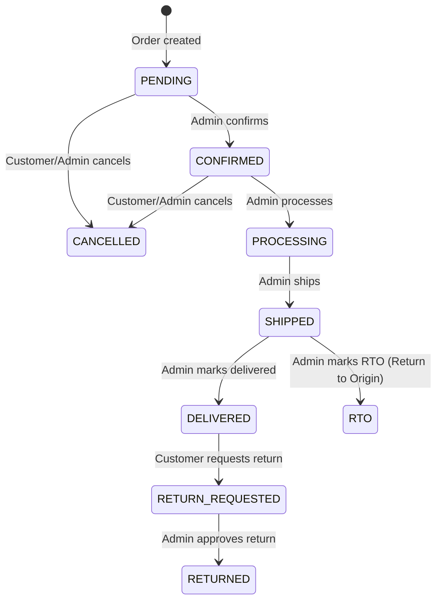

# Orders Module

**Path**: `src/orders/`

## Files

| File | Purpose |
| --- | --- |
| `orders.module.ts` | Standalone module, exports `OrdersService` |
| `orders.controller.ts` | Customer + admin order endpoints |
| `orders.service.ts` | Core order lifecycle logic (largest service in the codebase, ~600 lines) |
| `dto/create-order.dto.ts` | addressId, paymentMethod, notes |
| `dto/update-order-status.dto.ts` | status (OrderStatus enum) |
| `dto/create-return-request.dto.ts` | reason (max 500 chars) |
| `dto/create-rto.dto.ts` | reason (max 500 chars) |
| `dto/return-order.dto.ts` | ⚠️ Exists but unused |

## Dependencies

- **PostgresModule** (global) — queries cart, products, media, orders directly

## Controller Endpoints

### Customer Endpoints

| Method | Endpoint | Description |
| --- | --- | --- |
| POST | `/orders` | Create order from active cart |
| GET | `/orders/me` | List customer's orders |
| GET | `/orders/me/:id` | Get single order detail |
| PATCH | `/orders/:id/cancel` | Cancel own order |
| POST | `/orders/:id/return` | Request return for delivered order |

### Admin Endpoints

| Method | Endpoint | Description |
| --- | --- | --- |
| GET | `/orders` | List all orders (with user) |
| GET | `/orders/:id` | Get any order detail |
| PATCH | `/orders/:id/status` | Update order status |
| POST | `/orders/:id/rto` | Mark shipped order as RTO |

## Service Methods

### `createOrder(userId, dto)` — The Core Transaction

**This is the most critical business logic in the entire application.** It runs inside `prisma.$transaction()`:

```
1. Find ACTIVE cart with all items (include productSize → product → category, size)
2. Validate cart exists and has items → BadRequestException
3. Find and validate shipping address → NotFoundException
4. Fetch primary media for all products in cart (batch query)
5. For each cart item:
   a. Validate product status is ACTIVE and not deleted → BadRequestException
   b. Validate productSize is active and not deleted → BadRequestException
   c. Validate availableStock ≥ quantity → BadRequestException
   d. Calculate item total = sellingPrice × quantity
   e. Build product snapshot for OrderItem:
      - productName, productSlug, sku, sizeName
      - primaryMediaId (from batch media query)
      - price, quantity, total
6. Calculate subtotal (sum of all item totals)
7. Calculate shipping:
   - FREE if subtotal ≥ 999
   - ₹99 otherwise
8. Calculate total = subtotal + shipping
9. Generate order number (see below)
10. Create Order with nested:
    - OrderAddress (snapshot of shipping address)
    - OrderItems (all line items with snapshots)
    - Payment (amount = total, method from DTO, status = PENDING)
11. Decrement stock for each item:
    - Uses prisma.productSize.update with:
      availableStock: { decrement: quantity }
    - ⚠️ No optimistic concurrency check on the decrement
12. Convert cart: set status = CONVERTED
13. Return order with all relations
```

### `generateOrderNumber(tx)` — Advisory Lock Pattern

```typescript
async generateOrderNumber(tx: Prisma.TransactionClient) {
  // 1. Acquire advisory lock to prevent race conditions
  await tx.$queryRawUnsafe(`SELECT pg_advisory_xact_lock(1001)`);

  // 2. Get today's date key (YYMMDD format)
  const dateKey = format(new Date(), 'yyMMdd');

  // 3. Upsert counter: increment if exists, create if not
  const counter = await tx.orderCounter.upsert({
    where: { dateKey },
    update: { lastSequence: { increment: 1 } },
    create: { dateKey, lastSequence: 1 },
  });

  // 4. Format: KZ-YYMMDD-0001
  return `KZ-${dateKey}-${String(counter.lastSequence).padStart(4, '0')}`;
}
```

This ensures globally unique, sequential order numbers even under concurrent requests.

### `cancelOrder(orderId, userId)`

1. Find order → `NotFoundException`
2. Check order belongs to user
3. Check status is `PENDING` or `CONFIRMED` → `BadRequestException` otherwise
4. Set status = `CANCELLED`
5. Restore stock for each item (`increment: quantity`)
6. ⚠️ **No transaction wrapper** — see [known-issues.md](../known-issues.md#3)

### `requestReturn(userId, orderId, dto)`

1. Find order → `NotFoundException`
2. Check belongs to user
3. Check status is `DELIVERED` → `BadRequestException` otherwise
4. Set status = `RETURN_REQUESTED`, store `returnReason`

### `markRto(orderId, dto)` (Admin only)

1. Find order → `NotFoundException`
2. Check status is `SHIPPED` → `BadRequestException` otherwise
3. Set status = `RTO`, store `rtoReason`
4. Restore stock for each item

### `updateStatus(orderId, dto)` (Admin only)

1. Find order → `NotFoundException`
2. Update status (no transition validation — any status can be set)

### `getCustomerOrders(userId)`

Returns all orders for the user with items and payment, ordered by creation date desc.

### `getCustomerOrder(userId, orderId)`

Returns single order with items, address, and payment. Validates ownership.

### `getAllOrders()` (Admin)

Returns all orders with user info, items, and payment.

### `getOrder(orderId)` (Admin)

Returns any order with items, address, and payment.

## Order Status Transitions



> ⚠️ The `updateStatus()` admin endpoint does **not** enforce these transitions. An admin can set any status on any order.

## Shipping Calculation

```typescript
const SHIPPING_THRESHOLD = 999;
const SHIPPING_CHARGE = 99;

const shipping = subtotal >= SHIPPING_THRESHOLD
  ? new Prisma.Decimal(0)
  : new Prisma.Decimal(SHIPPING_CHARGE);
```

## Product Snapshots

`OrderItem` stores snapshots of product data at order time:

| OrderItem Field | Source |
| --- | --- |
| `productName` | `product.name` |
| `productSlug` | `product.slug` |
| `sku` | `productSize.sku` |
| `sizeName` | `size.label` |
| `primaryMediaId` | `MediaUsage.mediaId` (batch loaded) |
| `price` | `productSize.sellingPrice` |
| `quantity` | `cartItem.quantity` |
| `total` | `price × quantity` |

This ensures order history is immutable even if products are later modified or deleted.
